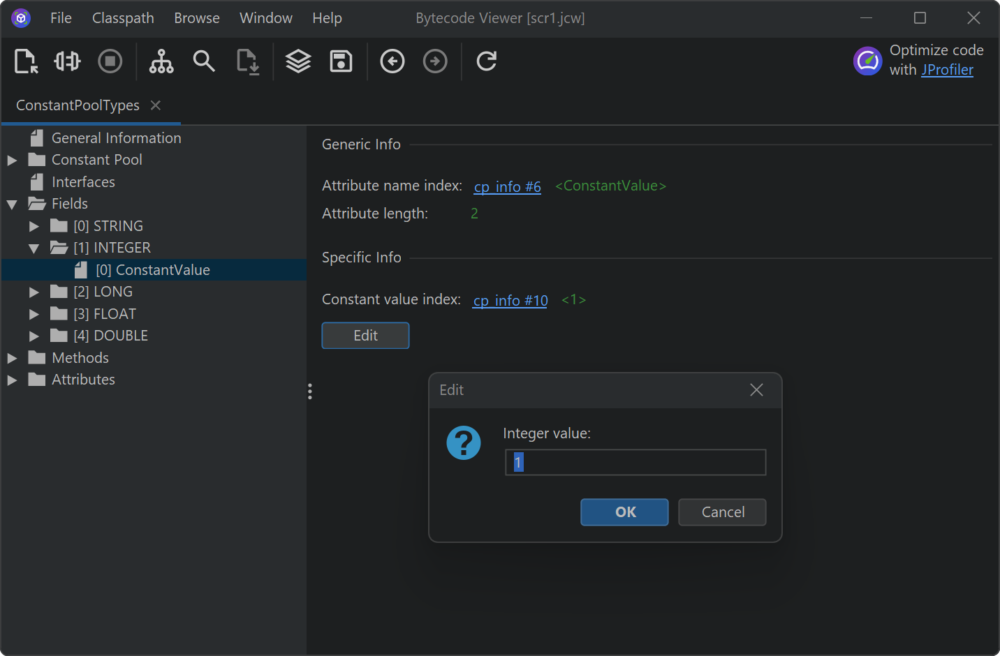
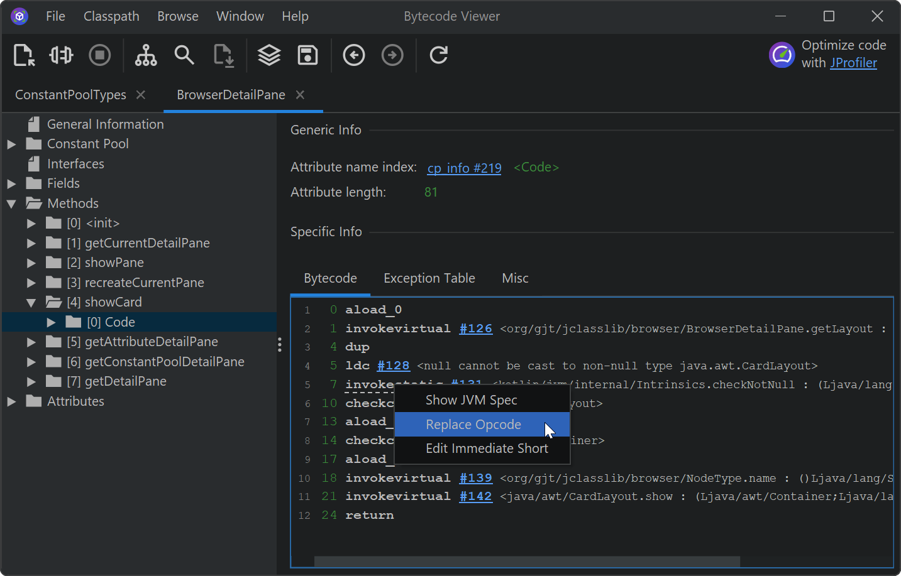
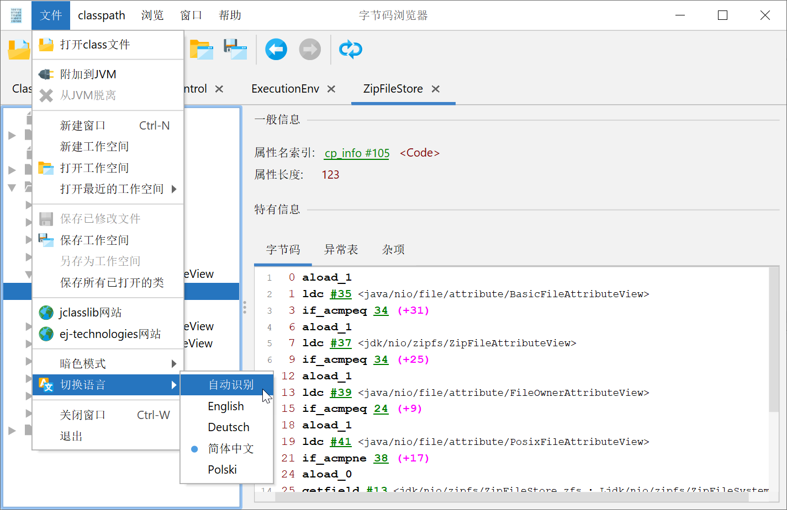

# jclasslib bytecode editor and Kotlin Multiplatform class file library

## Download

Installers can be downloaded from the [releases section](https://github.com/ingokegel/jclasslib/releases), on macOS you can install it via HomeBrew with
```sh
brew install jclasslib-bytecode-viewer
```

## Purpose

jclasslib bytecode editor is a tool that visualizes all aspects of compiled Java class files and the contained bytecode.
Many aspects of class files can be edited in the UI.
In addition, it contains a Kotlin Multiplatform library that enables developers to read and write Java class files
and bytecode.

## Maven repository

The Kotlin Multiplatform library to read and write JVM class files is available on Maven Central under 
the coordinates: `org.jclasslib:jclasslib-data:<version>`. 

Platform-specific artifacts are provided under
`org.jclasslib:jclasslib-data-jvm:<version>` and `org.jclasslib:jclasslib-data-js:<version>`.

## jclasslib UI

In the main window of the jclasslib bytecode viewer, you can open multiple class files at the same time, by
selecting class or JAR files, browsing a configured classpath or dragging class files on top of the window. 


## Editing

All constant pool entries can be edited. Referenced constant pool entries can directly be edited from the context
menu that is shown by the "Edit" button of attributes and constant pool entries.



Bytecode instructions can be edited from the context menu:



## Dark mode

Dark mode can be enabled persistently by selecting "File->Dark mode" in the main menu. 


## Localizations

Several localizations are available and can be chosen in the UI:



## IntelliJ IDEA plugin

There is a plugin for IntelliJ IDEA that can be installed via the plugin manager. The action in the "View menu" 
can be invoked when a Java, Groovy or Kotlin file is open in the editor.


The bytecode will be shown in the "jclasslib" tool window on the right hand side. Multiple class files can be open
at the same time.


## License

jclasslib bytecode editor is released under the [GPL, Version 2.0](https://www.gnu.org/licenses/gpl-2.0.html).
