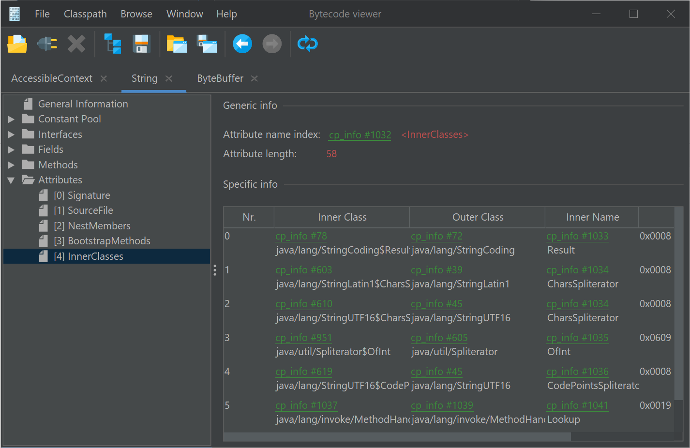
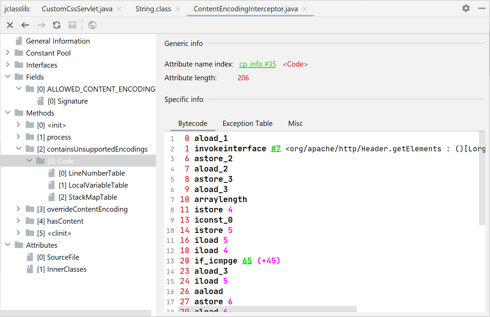

# jclasslib bytecode viewer

## Purpose

jclasslib bytecode viewer is a tool that visualizes all aspects of compiled Java class files and the contained bytecode. In addition, it contains a library that enables developers to read and write Java class files and bytecode.

Dark mode can be enabled persistently by selecting "File->Dark mode" in the main menu. 

## IntelliJ IDEA plugin

There is a plugin for IntelliJ IDEA that can be installed via the plugin manager. The action in the "View menu" 
can be invoked when a Java, Groovy or Kotlin file is open in the editor.

The bytecode will be shown in the "jclasslib" tool window on the right hand side. Multiple class files can be open
at the same time.

## License

jclasslib bytecode viewer is released under the [GPL, Version 2.0](https://www.gnu.org/licenses/gpl-2.0.html).

## Download

Installers can be downloaded from the [releases section](https://github.com/ingokegel/jclasslib/releases).
