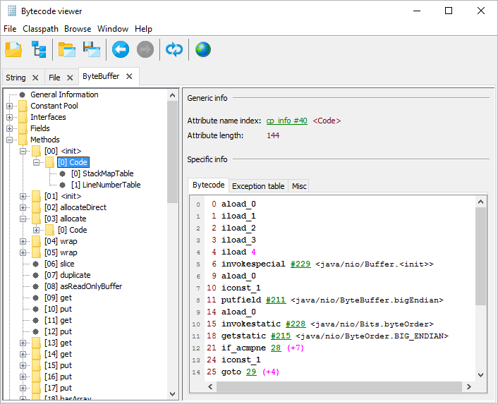

# jclasslib bytecode viewer

## Purpose

jclasslib bytecode viewer is a tool that visualizes all aspects of compiled Java class files and the contained bytecode. In addition, it contains a library that enables developers to read and write Java class files and bytecode.

## License

jclasslib bytecode viewer is released under the [GPL, Version 2.0](https://www.gnu.org/licenses/gpl-2.0.html).

## Download

Installers can be downloaded from the [releases section](https://github.com/ingokegel/jclasslib/releases).
